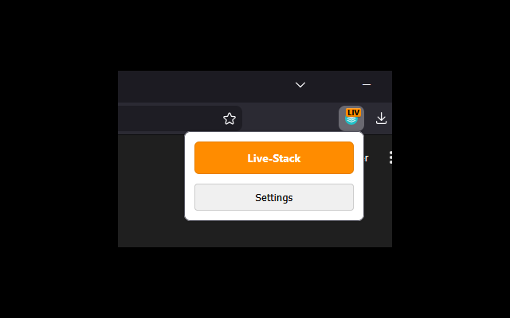

<a name="readme-top"></a>

<div align="center">
<a href="https://github.com/domidodo/TechStackIdentifier_BrowserExtension/graphs/contributors">

</a>
<a href="https://github.com/domidodo/TechStackIdentifier_BrowserExtension/network/members">

</a>
<a href="https://github.com/domidodo/TechStackIdentifier_BrowserExtension/stargazers">

</a>
<a href="https://github.com/domidodo/TechStackIdentifier_BrowserExtension/issues">

</a>
<a href="https://github.com/domidodo/TechStackIdentifier_BrowserExtension/blob/main/LICENSE">

</a>

<br />
<br />
<a href="https://github.com/domidodo/TechStackIdentifier_BrowserExtension">
  
</a>
<h3 align="center">TechStack Identifier (browser extension)</h3>

<p align="center">
A lightweight browser extension for Chrome, Edge, and Brave that instantly identifies which environment (e.g., Staging, Production, Dev) you are currently browsing.<br />
<br />
The extension reads a specific meta-tag from the HTML head and updates the browser toolbar icon's color, badge text, and tooltip accordingly.<br />
<br />
<a href="https://github.com/domidodo/TechStackIdentifier_BrowserExtension/issues">Report Bug</a>
·
<a href="https://github.com/domidodo/TechStackIdentifier_BrowserExtension/issues">Request Feature</a>
</p>
</div>

## Table of Contents

<ol>
<li><a href="#about-the-project">About The Project</a></li>
<li><a href="#key-features">Key features</a></li>
<li><a href="#built-with">Built With</a></li>
<li><a href="#screenshots">Screenshots</a></li>
<li><a href="#installation">Installation</a></li>
<li><a href="#website-integration">Website Integration</a></li>
<li><a href="#configuration">Configuration</a></li>
<li><a href="#contributing">Contributing</a></li>
<li><a href="#license">License</a></li>
</ol>

<!-- ABOUT THE PROJECT -->

## About The Project

When working with multiple environments like Production, Staging, and Development, it’s easy to lose track of which tab represents which instance. The TechStack Identifier solves this by providing immediate visual feedback directly in your browser's toolbar.

## Key features

- Auto-Detection: Scans for `<meta name="company:tech">` tags.
- Profile-Based: Apply consistent colors/labels across multiple domains using profiles.
- Subdomain Support: Map a root domain once, and all subdomains inherit the settings.
- Exceptions: Force specific displays for exact URLs.

<p align="right">(<a href="#readme-top">back to top</a>)</p>

## Built With

* [![JavaScript][Js]][Js-url]
* [![HTML][Html]][Html-url]
* [![CSS][Css]][Css-url]

<p align="right">(<a href="#readme-top">back to top</a>)</p>

## Screenshots

<div align="center">
  
</div>

<p align="right">(<a href="#readme-top">back to top</a>)</p>


<!-- INSTALLATION -->

## Installation

FireFox: <br/>
https://addons.mozilla.org/en-US/firefox/addon/techstack-identifier/


Google Chrome: <br/>
https://chrome.google.com/webstore/detail/techstack-identifier/bppcohfjnmjlengdelbjcepjmeackcnb


<p align="right">(<a href="#readme-top">back to top</a>)</p>


<!-- INTEGRATION -->

## Website Integration

To enable detection, add this tag to your website's <head>:
```
<meta name="company:tech" content="S" />
```

The extension matches the content value against your defined profiles.

<p align="right">(<a href="#readme-top">back to top</a>)</p>

<!-- CONFIGURATION -->

## Configuration

The extension is fully customizable via a JSON editor in the settings.
```
{
  "profiles": {
    "standard": {
      "S": { "label": "Staging", "color": "#1E90FF", "badge": "STG" },
      "P": { "label": "Production", "color": "#FF0000", "badge": "PRD" }
    }
  },
  "domainMapping": {
    "default": "standard",
    "example.com": "standard"
  }
}
```

<p align="right">(<a href="#readme-top">back to top</a>)</p>


<!-- CONTRIBUTING -->

## Contributing

If you have a suggestion that would make this better, please fork the repo and create a pull request. You can also simply open an issue with the tag "enhancement".
Don't forget to give the project a star! Thanks again!

1. Fork the Project
2. Create your Feature Branch (`git checkout -b feature/AmazingFeature`)
3. Commit your Changes (`git commit -m 'Add some AmazingFeature'`)
4. Push to the Branch (`git push origin feature/AmazingFeature`)
5. Open a Pull Request

<p align="right">(<a href="#readme-top">back to top</a>)</p>

<!-- LICENSE -->

## License

Distributed under the MIT License. See `LICENSE` for more information.

<p align="right">(<a href="#readme-top">back to top</a>)</p>

<!-- MARKDOWN LINKS & IMAGES -->

[Js]: https://shields.io/badge/JavaScript-F7DF1E?logo=JavaScript&logoColor=000&style=flat-square
[Js-url]: https://wiki.selfhtml.org/wiki/JavaScript

[Html]: https://img.shields.io/badge/HTML-239120?style=for-the-badge&logo=html5&logoColor=white
[Html-url]: https://wiki.selfhtml.org/wiki/HTML

[Css]: https://img.shields.io/badge/CSS-239120?&style=for-the-badge&logo=css3&logoColor=white
[Css-url]: https://wiki.selfhtml.org/wiki/CSS